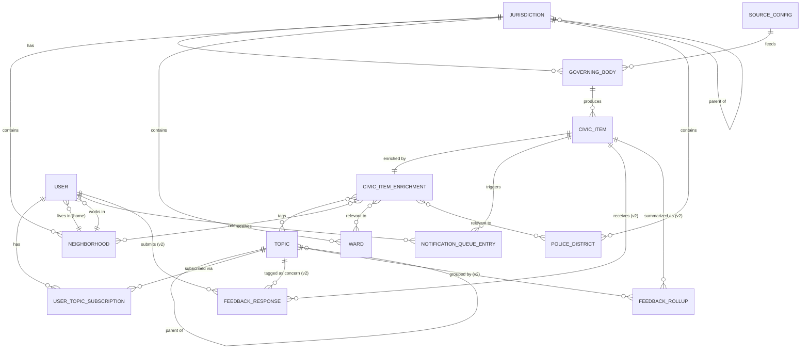

# Civic Pulse STL — Data Models

> **Status: WIP / Draft.** This document captures the data model thinking from early brainstorming sessions. Nothing here is final, nothing here has been implemented, and field names/types are illustrative (not a committed schema). Expect this to change as we validate ingestion sources and onboarding flow design.

## Design Principles Behind This Schema

- **Separate scraped fact from AI-generated interpretation.** `CivicItem` (raw/source-of-truth) is distinct from `CivicItemEnrichment` (AI-derived summary/tags), so we can re-run or improve enrichment without touching source data, and so we have an audit trail for AI output.
- **Decouple "platform" from "governing body."** Many boards share one underlying agenda platform instance (e.g., every Chesterfield board lives on one CivicClerk portal). `SourceConfig` models the platform/adapter once; many `GoverningBody` rows can point to it.
- **No street addresses.** Per an early privacy decision, we do not collect precise home addresses. The finest geographic grain captured for a user is neighborhood/ward.
- **No functional anonymity (relevant to v2 feedback model).** `FeedbackResponse.user_id` is always populated — never nullable — enforcing accountability at the schema level, not just as policy.
- **Geographic layers don't nest cleanly.** Neighborhoods, wards, and police districts are modeled as separate tables with their own boundary geometries rather than a forced hierarchy, because real-world St. Louis geography doesn't nest them consistently.

---

## Entities

### 1. `Jurisdiction`
Any government entity with geographic scope — a city, a county, or an unincorporated area governed directly by a county.

```
Jurisdiction {
  id
  name                    // "City of St. Louis", "St. Louis County", "Clayton, MO"
  type                    // enum: city | county | unincorporated_area | special_district
  state                   // "MO" | "IL"
  parent_jurisdiction_id  // nullable, e.g. Clayton -> St. Louis County
  boundary_geometry       // GeoJSON polygon — maps a resident's neighborhood to this jurisdiction
  population              // optional, used for expansion prioritization
  status                  // enum: active | planned | not_yet_supported
}
```

### 2. `GoverningBody`
Every board, council, commission, or independent special district whose actions residents might care about (Board of Aldermen, Excise Division, Mehlville Fire Protection District, a school board, etc.).

```
GoverningBody {
  id
  jurisdiction_id         // FK -> Jurisdiction
  name                    // "Board of Aldermen", "Civilian Oversight Board"
  category                // enum: legislative | zoning_planning | police_oversight | health |
                          //       parks | redevelopment_tif | building_code | elections |
                          //       housing | school_board | fire_district | other
  remit_summary           // short plain-language description of what it decides
  is_independent_district // bool — true for school/fire districts (separately elected, not under city/county)
  source_config_id        // FK -> SourceConfig
  status                  // active | defunct | in_legal_limbo
}
```

### 3. `SourceConfig`
Ingestion adapter configuration. Decoupled from `GoverningBody` because platform instances are frequently shared across many bodies within one jurisdiction.

```
SourceConfig {
  id
  platform_type            // enum: civicclerk | civicweb | civicplus_agendacenter |
                            //       custom_cms | revize | boarddocs | diligent_community |
                            //       boardbook | open_data_api | manual
  base_url
  adapter_version           // which scraper/parser implementation handles this source
  requires_pdf_extraction   // bool
  has_structured_api        // bool — true for Open311/CSB, LRA, TIF GeoJSON-style feeds
  polling_frequency
  last_successful_fetch_at
  auth_config               // nullable
}
```

### 4. `CivicItem`
Central content entity — one row per agenda item, ordinance, license application, hearing notice, etc. This is the raw/source-of-truth record.

```
CivicItem {
  id
  governing_body_id        // FK -> GoverningBody
  external_id               // source system's own identifier (board bill #, case #, etc.)
  item_type                 // enum: agenda_item | ordinance | board_bill | license_application |
                            //       hearing_notice | minutes | zoning_case | tif_action | other
  title                     // raw title from source
  raw_text                  // full scraped/extracted text (kept for re-processing)
  source_url
  status                    // enum: scheduled | pending_hearing | approved | denied | withdrawn | enacted
  meeting_date               // nullable
  published_at
  ingested_at
  last_enriched_at
}
```

### 5. `CivicItemEnrichment`
AI-derived interpretation layer, separated from `CivicItem` so re-running enrichment doesn't mutate source data, and so we have a reviewable audit trail.

```
CivicItemEnrichment {
  id
  civic_item_id             // FK -> CivicItem
  plain_language_summary     // 2-3 sentence LLM-generated summary
  topics[]                   // FK[] -> Topic
  neighborhood_ids[]          // FK[] -> Neighborhood
  ward_ids[]                  // FK[] -> Ward
  police_district_ids[]       // FK[] -> PoliceDistrict
  urgency_score               // derived from meeting_date proximity
  confidence                  // tagging/extraction confidence, used for QA sampling
  model_version                // LLM/prompt version, for reproducibility and audit
  reviewed_by_human            // bool — spot-check QA workflow flag
}
```

### 6. `Topic`
Flat-but-hierarchical-capable taxonomy.

```
Topic {
  id
  name                      // "Liquor Licensing", "Traffic Calming", "Zoning"
  parent_topic_id            // nullable — sub-topics, e.g. "Traffic" -> "Speeding" (used in v2 feedback)
  category                   // top-level grouping (Land Use, Public Safety, Education, etc.)
}
```

### 7. Geographic Layers — `Neighborhood`, `Ward`, `PoliceDistrict`
Modeled separately rather than nested, since they don't align cleanly in St. Louis.

```
Neighborhood   { id, jurisdiction_id, name, boundary_geometry }
Ward           { id, jurisdiction_id, number, alderman_name, boundary_geometry }
PoliceDistrict { id, jurisdiction_id, number, boundary_geometry }
```

### 8. `User`

```
User {
  id
  email
  verification_status       // enum: unverified | email_verified | neighborhood_verified
  home_neighborhood_id       // FK, nullable until onboarding complete
  home_ward_id               // FK, derived from neighborhood
  work_neighborhood_id       // FK, nullable
  delivery_preference        // enum: app_only | weekly_email | both (native push reserved for v2)
  created_at
  last_active_at
}
```

No street address is ever collected — consistent with the privacy-first onboarding decision from brainstorming.

### 9. `UserTopicSubscription`

```
UserTopicSubscription {
  user_id
  topic_id
  created_at
}
```

### 10. `NotificationQueueEntry`
The join between "what a user should see" and "why" — powers both the in-app feed and the generated weekly email digest from one underlying model.

```
NotificationQueueEntry {
  id
  user_id
  civic_item_id
  match_reason               // enum: topic_match | home_neighborhood | work_neighborhood |
                              //       ward_match | commute_inference (v2)
  relevance_label             // enum: direct_impact | nearby | indirect | topic_match_only | fyi
                              // personalized per user-item pair — see notification-design-and-relevance-model.md
  why_this_matters_text        // generated per user: combines CivicItemEnrichment's objective
                              // scope/geometry facts with this user's specific neighborhood/topic
                              // match. Must never inflate weak relevance — honesty over engagement.
  surfaced_at
  delivered_via               // enum: app_feed | email_digest
  opened_at                   // nullable — basic QA signal, deliberately NOT used to optimize engagement
}
```

**Why `relevance_label` and `why_this_matters_text` live here, not on `CivicItemEnrichment`:** they depend on a specific user's home/work neighborhood relative to the item's scope, so the same `CivicItem` can produce a "Direct Impact" label for one user and an "FYI" label for another. `CivicItemEnrichment` stays strictly objective (what the item says, who it applies to); `NotificationQueueEntry` is where that objective data gets combined with one user's location/topic data into personalized, honest relevance framing — computed at notification-generation time, not stored as a property of the item itself.

### 11. V2 (not building yet) — `FeedbackResponse` / `FeedbackRollup`
Captured here for completeness since it shapes the schema design (e.g., why `User` needs verification status), but explicitly deferred past v1.

```
FeedbackResponse {
  id
  civic_item_id
  user_id                     // always populated — no functional anonymity, enforced at schema level
  stance                       // enum: support | oppose | question | neutral
  concern_tags[]               // FK[] -> Topic (sub-topic granularity, e.g. "Traffic -> Speeding")
  free_text                    // optional, short — shown only as elaboration on a concern_tag
  created_at
}

FeedbackRollup {               // precomputed, not query-time
  civic_item_id
  concern_tag_id
  response_count
  representative_quotes[]       // sampled, not exhaustive
  unspecified_count              // responses with no sub-tag — reported honestly, never silently bucketed
  generated_at
}
```

---

## ERD (entity relationships)



---

## Open Questions / Not Yet Resolved

- Exact geocoding/neighborhood-matching approach for onboarding (user selects from a list/map vs. typed autocomplete).
- Whether `SourceConfig.adapter_version` should version per-platform-type or per-jurisdiction-instance (some jurisdictions customize their platform instance enough that one adapter version might not cleanly cover all of them).
- How `CivicItemEnrichment` handles re-enrichment when a `CivicItem`'s `status` changes after initial ingestion (e.g., hearing rescheduled) — new enrichment row vs. update in place.
- Commute-corridor inference (`match_reason: commute_inference`) has no supporting data model yet — flagged as v2+ and deliberately left unmodeled here.
- Exact algorithm for deriving `relevance_label` from geometry/scope data (e.g., what distance threshold separates "direct_impact" from "nearby") is not yet defined — needs testing against real ingested items before finalizing.
- The relevance vocabulary itself (`direct_impact | nearby | indirect | topic_match_only | fyi`) is a first draft, not yet pressure-tested against ambiguous real-world cases — see `notification-design-and-relevance-model.md`.

## Related Documents
- `notification-design-and-relevance-model.md` — the "why this matters" design and relevance vocabulary that motivates the `NotificationQueueEntry` fields above.
- `moderation-and-signal-notes.md` — the anti-noise/no-manufactured-relevance philosophy that constrains how `why_this_matters_text` should ever be worded.
- `project-brief.md` — overall concept and scope.
